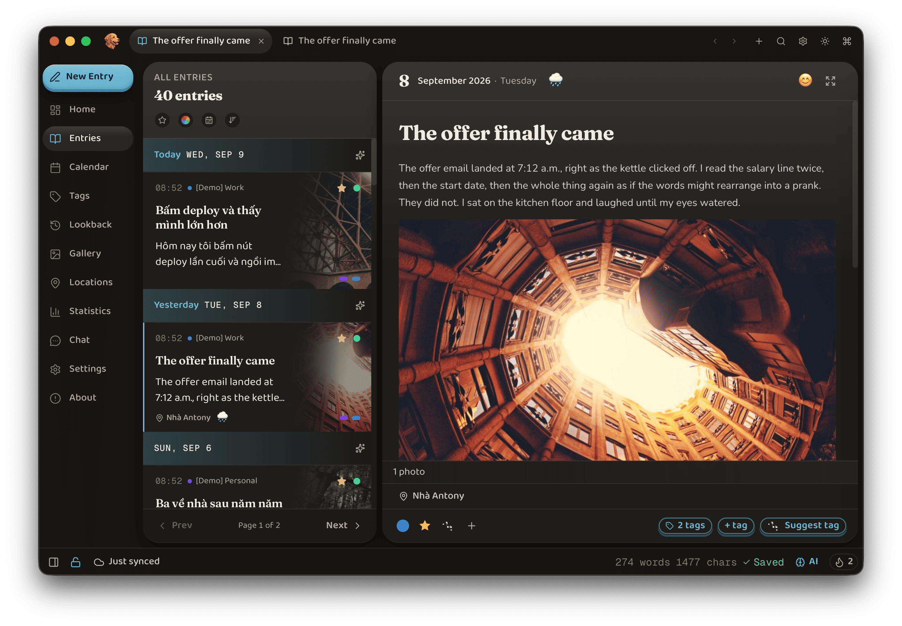

<div align="center">
  
  <h1>Memlore</h1>
  <p>Your personal lore, your life, remembered.<br />A cross-platform, privacy-first, local-first journal — with rich, optional AI.</p>
</div>

> [!WARNING]
> Memlore is under **heavy development**. There is no production release yet — APIs, schemas, and data formats can change freely. Current work focuses on the **desktop macOS** app. Windows, Linux, iOS, and Android are planned and coming soon.



## ✨ Features

- **Local-first & private** — works fully offline. Your journal stays on your device. No Memlore server, no account, no telemetry.
- **Rich editor** — write with markdown shortcuts, then add plugins for anything: math, code, tables, checklists, media, and more.
- **Find anything** — instant search, tags, favorites, calendar, and On This Day lookback.
- **Media & places** — photos, video, voice memos, a media gallery, and a locations map.
- **AI, when you want it** — a rich set of optional AI tools over your journal. Bring your own provider or run models on-device. Off until you opt in.
- **Sync you control** — encrypted sync over your own Google Drive or iCloud Drive, with more services coming. Recover across devices, see who is connected, and revoke any of them.
- **Locks** — lock the app with a password or Touch ID. Second lock hides chosen entries behind an extra password. Invisible lock keeps separate vaults that vanish until you enter the right password.
- **Import & export** — import from Day One, Journey, Apple Journal, markdown, and more; export to files.
- **Yours to look at** — UI and layout are highly customizable, with different design systems and layouts to choose from.

## 💻 Platforms

**macOS** (desktop) is the only supported target today. Windows, Linux, iOS, and Android are planned.

## 🛠️ Tech stack

| Layer  | Technology                                                                           |
| ------ | ------------------------------------------------------------------------------------ |
| App    | Tauri 2 (Rust) + React 19 + TypeScript + Vite                                        |
| UI     | Tailwind CSS v4, Zustand, i18next, Leaflet, Recharts                                 |
| Editor | TipTap + Yjs (CRDT)                                                                  |
| Data   | SQLite / SQLCipher, FTS5                                                             |
| Crypto | AES-256-GCM, Argon2id                                                                |
| Sync   | Yjs over iCloud Drive / Google Drive                                                 |
| AI     | HTTP providers + opt-in on-device embedding (`fastembed`) and `llama-server` sidecar |

## 🚀 Development

**Prerequisites:** [Rust](https://rustup.rs/) 1.77+, [Node.js](https://nodejs.org/) 20+, [pnpm](https://pnpm.io/) 9+, and the [Tauri prerequisites](https://tauri.app/start/prerequisites/) for your OS. VS Code: install the recommended extensions when prompted (format-on-save + ESLint).

```bash
pnpm install
pnpm tauri dev                    # native app
# MEMLORE_REACT_DEVTOOLS=1 pnpm tauri dev   # optional, after `npx react-devtools`

pnpm web:dev                      # browser UI preview — http://localhost:5175
pnpm web:build && pnpm web:preview

pnpm test                         # frontend
cd src-tauri && cargo test        # backend
pnpm lint && pnpm format:check

pnpm tauri build                  # current platform
```

Optional `.env` (copy `.env.example`): [Google Drive OAuth](docs/gdrive-oauth-setup.md) and [MapKit JS](docs/mapkit-js-setup.md).

### 🔄 Reset local state

```bash
# Quit the app first
./scripts/reset-machine.sh           # interactive
./scripts/reset-machine.sh --force   # non-interactive local wipe
```

Wipes the app data dir, Keychain biometric key, and WebView caches. Cloud appdata (Google Drive hidden folder, iCloud) is not deleted automatically — disconnect or wipe from the app / provider UI if you need a clean cloud too.

Need demo data: Settings → Data → **Import** → **Seed demo data**.

## 🤝 Contributing

See [CONTRIBUTING.md](CONTRIBUTING.md).

## 📄 License

Memlore is licensed under [AGPL-3.0-or-later](LICENSE).
