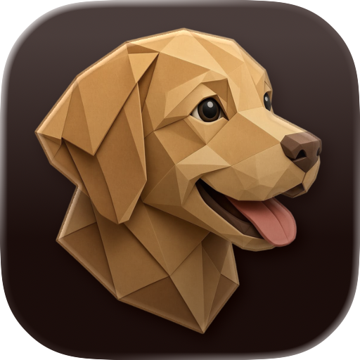
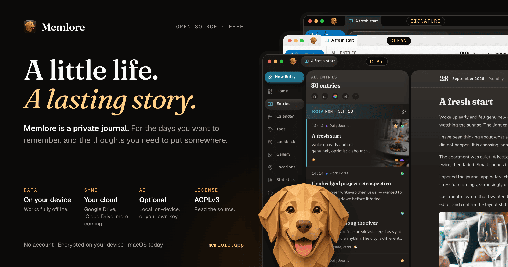

<div align="center">
  
  <h1>Memlore</h1>
  <p>A little life. A lasting story.<br />A cross-platform, privacy-first, local-first journal — with rich, optional AI.</p>
  <p>
    <a href="https://memlore.app">Website</a> ·
    <a href="https://dl.memlore.app/mac">Download for Mac</a> ·
    <a href="https://web.memlore.app">Web version</a> ·
    <a href="https://memlore.app/#demo">Live demo</a> ·
    <a href="https://youtu.be/Mv3LZ_P5lwg">Intro Video</a>
  </p>
</div>

> [!WARNING]
> Memlore is under active development. What is here today is reasonably stable, with a lot more still to come. Current focus is the **desktop macOS** app and the **web** version; Windows, Linux, iOS, and Android are planned.



## ✨ Features

- **Local-first & private** — works fully offline. Your journal stays on your device. No Memlore server, no account, no telemetry.
- **Rich editor** — write with markdown shortcuts, then add plugins for anything: math, code, tables, checklists, media, and more.
- **Find anything** — instant search, tags, favorites, calendar, and On This Day lookback.
- **Media & places** — photos, video, voice memos, a media gallery, and a locations map.
- **AI, when you want it** — a rich set of optional AI tools over your journal. Bring your own provider or run models on-device. Off until you opt in.
- **MCP server** — opt in to let desktop MCP clients search, read, create and append entries on your machine, so you can journal from the AI app you already use. Local only, off by default, and no AI provider required.
- **Sync you control** — encrypted sync over your own Google Drive or iCloud Drive, with more services coming. Recover across devices, see who is connected, and revoke any of them.
- **Locks** — lock the app with a password or Touch ID. Second lock hides chosen entries behind an extra password. Invisible lock keeps separate vaults that vanish until you enter the right password.
- **Import & export** — import from Day One, Journey, Apple Journal, markdown, and more; export to files.
- **Yours to look at** — UI and layout are highly customizable, with different design systems and layouts to choose from.

## 💻 Platforms

**macOS** (desktop) is the primary supported target today. Windows, Linux, iOS, and Android are planned.

## 🌐 Memlore Web

Memlore Web ([web.memlore.app](https://web.memlore.app)) is an in-browser companion to the desktop app. It allows reading, searching, and writing entries from any modern browser by connecting directly to your Google Drive `appDataFolder` without any Memlore intermediary server.

- **Zero-knowledge:** Master encryption keys are handled in WebAssembly memory and never leave the browser.
- **Safety first:** Uses an outbox intent model (`OutboxEntryV1`) — the web never mutates sync manifests directly; desktop imports and merges all changes with CRDT conflict resolution.
- **Onboarding:** Opens an existing desktop vault using your Google account and 24-word recovery phrase.
- **Documentation:** See the [Web companion guide](https://memlore.app/docs/web) and [Privacy Policy](https://memlore.app/privacy).

## 🛠️ Tech stack

| Layer  | Technology                                                                           |
| ------ | ------------------------------------------------------------------------------------ |
| App    | Tauri 2 (Rust) + React 19 + TypeScript + Vite                                        |
| Web    | React 19 + WebAssembly (Rust memlore-wasm) + IndexedDB + Cloudflare Worker            |
| UI     | Tailwind CSS v4, Zustand, i18next, Leaflet, Recharts                                 |
| Editor | TipTap + Yjs (CRDT)                                                                  |
| Data   | SQLite / SQLCipher, FTS5                                                             |
| Crypto | AES-256-GCM, Argon2id                                                                |
| Sync   | Yjs over iCloud Drive / Google Drive                                                 |
| AI     | HTTP providers + opt-in on-device embedding (`fastembed`) and `llama-server` sidecar |

## 🚀 Development

**Prerequisites:** [Rust](https://rustup.rs/) 1.88+, [Node.js](https://nodejs.org/) 20+, [pnpm](https://pnpm.io/) 9+, and the [Tauri prerequisites](https://tauri.app/start/prerequisites/) for your OS. VS Code: install the recommended extensions when prompted (format-on-save + ESLint).

`mockup/` is the in-browser preview of the Tauri app UI (mocked backend). `website/` is the public marketing site and interactive demo at [memlore.app](https://memlore.app). `web/` is the production Web companion app.

```bash
pnpm install
pnpm tauri dev                    # native app
# MEMLORE_REACT_DEVTOOLS=1 pnpm tauri dev   # optional, after `npx react-devtools`

# web companion (web/) — first time: create workers/web-auth/.dev.vars,
# see CONTRIBUTING.md → "Run it locally". Each web:local runs the OAuth Worker too.
pnpm web:local                    # hot reload on http://localhost:5176 (no CSP)
pnpm web:local --prod             # production bundle + headers on http://localhost:5176
pnpm web:test                     # web companion test suite

pnpm mockup:dev                   # app UI preview (mockup/) — http://localhost:5175
pnpm mockup:build && pnpm mockup:preview

pnpm website:dev                  # marketing site (website/) — http://localhost:5177
pnpm website:build && pnpm website:preview

pnpm test                         # frontend
cd src-tauri && cargo test        # backend
pnpm lint && pnpm format:check

pnpm tauri build --no-sign        # current platform (see CONTRIBUTING.md)
```

### Cargo build cache

A debug target on macOS grows past 10 GB. The `dev` profile in `src-tauri/Cargo.toml` keeps a fresh build small. To share that cache, `~/.cargo/config.toml` is created once per machine and stays outside git. Cargo does not expand `~`; the path below is `~/.cargo/shared-target`:

```toml
[build]
target-dir = ".cargo/shared-target"

[profile.dev]
opt-level = 1
split-debuginfo = "off"

[profile.dev.package."*"]
debug = "line-tables-only"
incremental = false
```

Keep that profile identical to `src-tauri/Cargo.toml`. After the config is in place, delete this repo's old `src-tauri/target` — `cargo clean` no longer sees it. `pnpm tauri dev` and `cargo test` use the shared directory. `pnpm tauri build` still writes `src-tauri/target`. Why these flags are set is in [CONTRIBUTING.md](CONTRIBUTING.md#cargo-build-cache).

Optional `.env` (copy `.env.example`): [Google Drive OAuth](docs/gdrive-oauth-setup.md) and [MapKit JS](docs/mapkit-js-setup.md).

### 📦 Releasing

Releases are cut with `/cf-ship`, a custom guide for
[Coding Friend](https://github.com/dinhanhthi/coding-friend) — an AI coding
assistant toolkit of skills, agents and hooks. Its skills live in
`.coding-friend/skills/` and are version-controlled so the release procedure
travels with the repo (`.coding-friend/config.json` stays local).

`.coding-friend/skills/cf-ship-custom/` holds that procedure:

| File                                                          | What it does                                                                                                           |
| ------------------------------------------------------------- | ---------------------------------------------------------------------------------------------------------------------- |
| [`README.md`](.coding-friend/skills/cf-ship-custom/README.md) | Usage guide — which command for which situation, and what to check when a release misbehaves                           |
| `SKILL.md`                                                    | The contract the assistant follows, loaded on demand                                                                   |
| `scripts/bump-info.sh`                                        | Reads commits since the last published tag, names the release state, and computes the next version. Writes nothing     |
| `scripts/bump.sh`                                             | Writes the version into `package.json`, `tauri.conf.json`, `Cargo.toml` and `Cargo.lock`, then verifies all four agree |

Memlore ships two platforms, each with its own version and tags:

| Platform                        | Ship with        | Version file                | Tag          | Pipeline                                      |
| ------------------------------- | ---------------- | --------------------------- | ------------ | --------------------------------------------- |
| Desktop app (macOS)             | `/cf-ship --mac` | `src-tauri/tauri.conf.json` | `v0.2.1`     | `release.yml`: signed, notarized `.dmg`       |
| Web companion (web.memlore.app) | `/cf-ship --web` | `web/version.json`          | `web-v0.1.0` | `deploy-web.yml`: Cloudflare Pages (+ Worker) |

`/cf-ship --all` ships every platform that has changes; plain `/cf-ship` asks
which one. The web is deployed only by pushing a `web-v*` tag, never by hand.
Releases are stable by default; `--rc` / `--beta` opt into a desktop prerelease
(kept off the stable update channel) or a web preview deploy. Changes under
`website/`, `mockup/`, `docs/` and `e2e/` never drive a version bump. See
[`.github/release-setup.md`](.github/release-setup.md) for the signing and
notarization secrets the desktop build needs; the web needs the
`CLOUDFLARE_API_TOKEN` and `CLOUDFLARE_ACCOUNT_ID` repository secrets.

### 🔄 Reset local state

```bash
# Quit the app first
./scripts/reset-machine.sh           # interactive
./scripts/reset-machine.sh --force   # non-interactive local wipe
```

Wipes the app data dir, Keychain biometric key, and WebView caches. Cloud appdata (Google Drive hidden folder, iCloud) is not deleted automatically — disconnect or wipe from the app / provider UI if you need a clean cloud too.

Need demo data: Settings → Data → **Import** → **Seed demo data**.

## 🤝 Contributing

See [CONTRIBUTING.md](CONTRIBUTING.md).

## 🙏 Credits

The [`website/`](website/) landing page visual style is adapted from [TablePro Web](https://github.com/TableProApp/web).

## 📄 License

Memlore is licensed under [AGPL-3.0-or-later](LICENSE).
